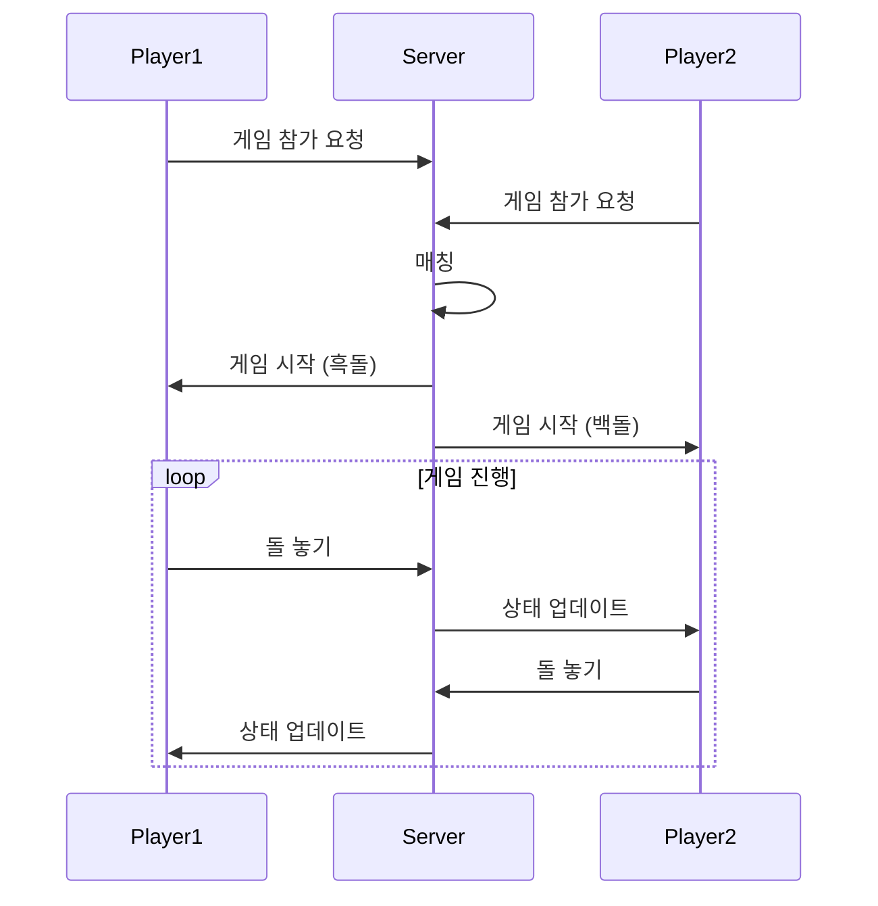
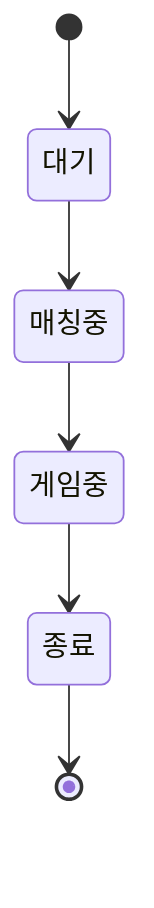

# 🎮 Online Gomoku Game

<div align="center">

> 🎯 실시간 멀티플레이어 오목 게임 플랫폼

</div>

---

## 📋 목차

-   [개요](#-개요)
-   [기능](#-기능)
-   [아키텍처](#-아키텍처)
-   [게임 규칙](#-게임-규칙)
-   [시작하기](#-시작하기)

---

## 📖 개요

실시간 웹소켓 기반의 온라인 오목 게임 플랫폼입니다.

### 시스템 구조



## ✨ 기능

### 핵심 기능

-   🎲 **실시간 멀티플레이어**

    -   WebSocket 기반 실시간 통신
    -   자동 플레이어 매칭
    -   게임 상태 동기화

-   🎯 **게임 시스템**

    -   오목 규칙 판정
    -   턴 기반 게임 진행
    -   승패 판정

-   🔄 **매칭 시스템**
    -   자동 룸 매칭
    -   대기열 관리
    -   게임 세션 관리

### 게임 상태 흐름



## 🏗️ 아키텍처

### 서버 구조

```yaml
서버:
    - WebSocket 서버
    - 게임 로직 엔진
    - 매칭 시스템

클라이언트:
    - 웹 인터페이스
    - WebSocket 클라이언트
    - 게임 렌더러
```

## 🎯 게임 규칙

### 기본 규칙

1. 흑돌이 먼저 시작
2. 교차점에 돌을 놓음
3. 5목 달성 시 승리

### 승리 조건

| 방향   | 설명            | 예시   |
| ------ | --------------- | ------ |
| 가로   | 가로 방향 5개   | ●●●●●  |
| 세로   | 세로 방향 5개   | ⋮      |
| 대각선 | 대각선 방향 5개 | ⋰ or ⋱ |
| 역대각 | 역대각 방향 5개 | ⋱ or ⋰ |

## 🚀 시작하기

### 플레이 방법

1. [stonify5.com](https://stonify5.com) 접속
2. 자동 매칭 대기
3. 상대방 매칭 시 게임 시작
4. 턴에 맞춰 돌 배치

### 조작 방법

| 동작 | 설명    |
| ---- | ------- |
| 클릭 | 돌 놓기 |

---

<div align="center">

**[맨 위로 올라가기](#-online-gomoku-game)**

Made with ❤️ by [in-jun](https://github.com/in-jun)

</div>
